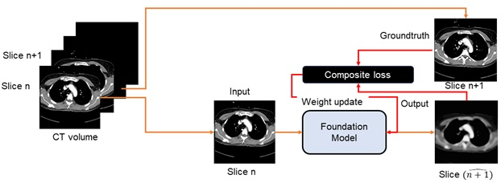
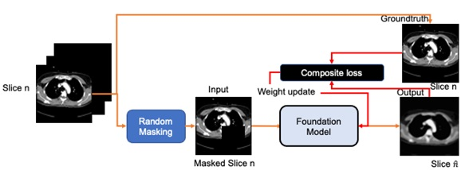

# FoundationChestCT
Foundation Model for Chest CT

The model has been trained with two types of self-supervision tasks
* Next slice prediction



* masked region prediction




### Model weights 

https://drive.google.com/drive/folders/1Ks_FZ3L7v2OPnsA1fbKyC0pSH9-_0gMn?usp=drive_link

## Training code
Please clone and install VAE library from ```https://github.com/AntixK/PyTorch-VAE.git```
Place ```vqvae_bn.py``` file in ```VAE/models/```
Replace ```VAE/models/__init__.py``` with included ```__init__.py```

The updated model file includes modifications made to the original vaector quantized VAE model in terms of batch normalization

FoundationChestCT.py contains code for self-supervised training through masked image pregion prediction.

```python3 FoundationChestCT.py --train_file /path/to/training/file --validation_file /path/to/validation/data```

Dataloader is provided, please plug in your own data file (csv format) with the volume_location column
