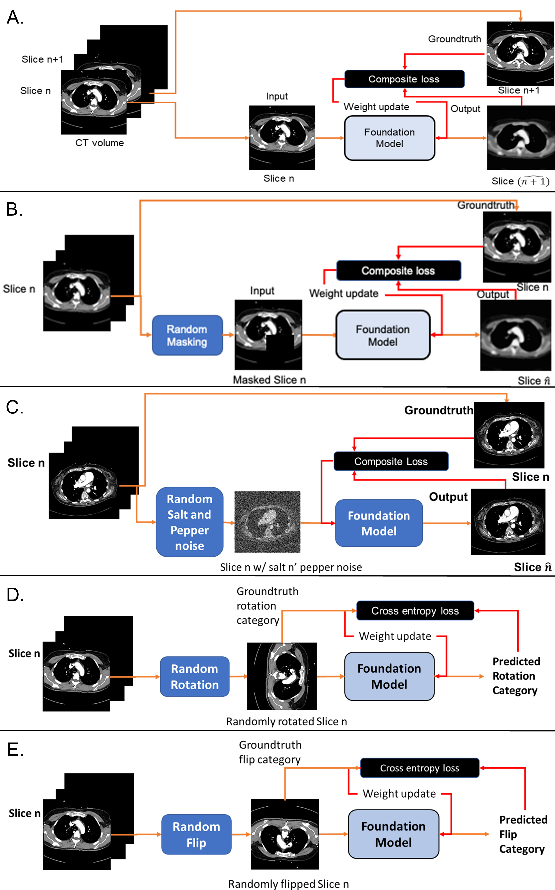

# FoundationChestCT
Foundation Model for Chest CT

Several self-supervision tasks were evaluated for model trianig as shown in the following figure. The code is provided for the best performing task, i.e., masked image region prediction.
* Self-supervision tasks




### Model weights 

Model weights will be made available upon requests made to author.

## Training code
- Clone and install VAE library from ```https://github.com/AntixK/PyTorch-VAE.git```
- Place ```vqvae_bn.py``` file in ```VAE/models/```
- Replace ```VAE/models/__init__.py``` with included ```__init__.py```
    The updated model file includes modifications made to the original vaector quantized VAE model in terms of batch normalization

- FoundationChestCT.py contains code for self-supervised training through masked image pregion prediction.

```python3 FoundationChestCT.py --train_file /path/to/training/file --validation_file /path/to/validation/data```

Dataloader is provided, please plug in your own data file (csv format) with the volume_location column
